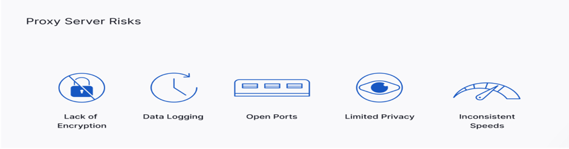

## Unconference Talk Topic: Proxy Server

## Index
1. How the Web Works?
2. Without Proxy Servers
3. What is Proxy Servers?
4. Why do we need to use Proxy Server?
5. Types of Proxy Servers
6. What Proxy Servers can't do?
7. VPNs
8. Apple used Two Proxy Servers to create a feature
9. How can it be helpful?

***

 

## How the Web Works?

***

 

## Without Proxy Servers

1. User request specific web page, the request directly goes to the server. 
2. Server gives a response directly to the user. 
3. No content filtering or security layer 
4. No encryption in the messages 
5. Server knows your external IP. This IP is sufficient to know your approximate geographical location. 
6. Access any cookies that are available on your computer. 
7. It knows your browser details, details of your browser plugins, OS version, and more.

***

 

## With Proxy Servers
A system or router that provides a gateway between users and the internet. Therefore, it helps prevent cyber attackers from entering a private network. It is a server, referred to as an “intermediary” because it goes between end-users and the web pages they visit online.


***

 

## Why do we need to use Proxy Servers
1. Performs the function of a firewall and filter. 
2. End-user or a network administrator can choose a proxy designed to protect data and privacy. 
3. Examines the data going in and out of your computer or network. 
4. Apply rules to prevent you from having to expose your digital address to the world. 
5. Only the proxy’s IP address is seen by hackers or other bad actors. 
6. Without your personal IP address, people on the internet do not have direct access to your personal data, schedules, apps, or files.

***

 

## Benefits of Proxy Servers

1. **Anonymous Browsing**: allow users to browse the web anonymously. 
2. **Security**: Some proxy server types (e.g., HTTPS proxies) can be configured to provide secure connections through encryption. 
3. **Web filtering**: Proxies used to restrict employees from accessing certain websites. it also log user activity, allowing organizations to monitor employees' Internet use at work.
4. **Web acceleration**: Proxy servers can speed up data transfer and conserve bandwidth by caching popular websites. 
5. **Changing Geo-Location**: Rotating proxies for Internet-based marketing.

***

 

## Types of Proxy Servers

**Forward Proxy**
A forward proxy is the most common form of a proxy server and is generally used to pass requests from an isolated, private network to the Internet through a firewall.

**Reverse Proxy**
In computer networks, a reverse proxy is the application that sits in front of back-end applications and forwards client requests to those applications. Reverse proxies help increase scalability, performance, resilience and security.

***

 

## What Proxy Servers Can't Do?

Like any third-party service operating over the Internet, proxy servers are not without their cyber risks. Users should understand the common risks associated with proxies to decide if they are fit-for-purpose.

1. **Lack of encryption**: Unless a proxy is configured with encryption, it will operate through an unsecured connection. 
2. **Data logging**: Proxy servers store users' IP addresses along with their web request data. 
3. **Open Ports**: Most proxies run on open ports, which can be exploited through security vulnerabilities. 
4. **Limited Privacy**: Free proxies often operate over unsecured networks and ad-based revenue models. 
5. **Inconsistent Speed**: Free proxies are susceptible to traffic overload. 

***

 

## VPNs

VPN stands for **"virtual private network"** — a service that **helps you stay private online**. 

A VPN establishes a secure, encrypted connection between your computer and the internet, providing a private tunnel for your data and communications while you use public networks.

***

 

## VPNs Vs Proxy Servers

1. VPNs create an encrypted tunnel between a user's device and the outside network. 
2. Proxy servers are often cheaper and faster than VPNs. 
3. Proxies need to be configured individually across apps. 
4. Web-based proxies are advantageous over VPNs on devices where users can't change software settings if privacy is not a significant concern. 
5. A proxy server can't encrypt data on its own; it just changes a user's IP address. 

***

 

## Private Relay

 

iCloud Private Relay "keeps your internet activity private"—and it does that in several ways. 
   Hiding your IP address from the websites that you visit.

The service encrypts your data as it leaves your device. 

Finally, it also keeps your DNS (Domain Name System) queries secret—essentially, the websites you're looking up on your device. 

***

 

## How it works?

iCloud Private Relay deploys what Apple calls **"dual-hop"** architecture—there are two stops or relays between your device and the internet. 
   **One stop is run by Apple**, where the IP address is visible but the name of the website you're visiting is encrypted 
   **Second stop is run by Apple's "third-party partners"** and knows the website you're visiting but not what your IP address is (it has the responsibility of assigning a new IP address for you).

No one gets to see every bit of information

IP addresses assigned to you by the second relay are rotated over time and between sessions, making it even harder for you to be tracked. 

***

 

## Two Proxy Servers

Instead of “tunneling” your data like a VPN, Private Relay uses two different proxy servers to hide your information.

When you access browser and go to a website, 
   Device connects to the first server, which is run by Apple. 
   configure the Private Relay settings to widen the scope of the random IP address that gets assigned to you, to your country and time zone.

Sends your data to the second server, via an encrypted connection. The second server’s job is to decrypt the info and send the right website. 

Why does Private Relay use two servers? The first server knows your IP address but doesn’t see the content you’re trying to access. The second server knows the content you want to access but doesn’t know your IP address.

***

 

## How can it be helpful
NCR also uses VPNs (third party) in many places.
If we replace VPNs with this solution what we will be getting:
   1. More control on what is happening in between sending and receiving requests 
   2. Data Logging will be with NCR only 
   3. Encryption policy will be of NCR only 
   4. Increase security policies as per solution requirements 
   5. No need to install or download additional software for support 
   6. Cost will also be reduced which are given to third party VPNs 
   7. Faster than VPNs

***

 

# Session Video Link: [Proxy Server](https://drive.google.com/file/d/1U_gK02Q7w1AGeoVy06KuQQpmw6pm3B9y/view?usp=sharing)